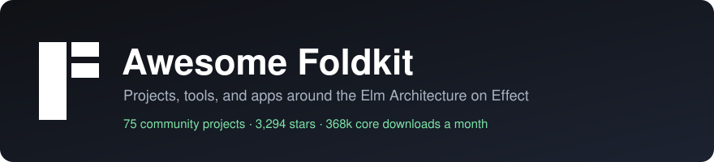

# Awesome Foldkit 

Libraries, tools, apps, and docs for [Foldkit](https://foldkit.dev), the TypeScript frontend framework built on [Effect](https://effect.website) with the Elm Architecture: one Model, a Message union, a pure update, and Commands for side effects.

  

Star and download badges load live. Every day a GitHub Action re-sorts the ecosystem by stars and flags archived or inactive projects. Every week it searches GitHub and npm for new projects.

> A Foldkit community project by [Foldhub](https://github.com/foldhub). To add a project, edit [`data/projects.toml`](data/projects.toml) and open a pull request. See [CONTRIBUTING.md](CONTRIBUTING.md).

## Contents

- [Start here](#start-here)
- [Compare and migrate](#compare-and-migrate)
- [Core packages](#core-packages)
- [Examples by the Foldkit team](#examples-by-the-foldkit-team)
- [Ecosystem](#ecosystem)
  - [Full stack and deployment](#full-stack-and-deployment)
  - [UI kits and styling](#ui-kits-and-styling)
  - [AI and agents](#ai-and-agents)
  - [Interop and tooling](#interop-and-tooling)
- [Apps built with Foldkit](#apps-built-with-foldkit)
- [Community](#community)
- [How this list stays current](#how-this-list-stays-current)

##  Start here

Foldkit docs and resources.

-  [foldkit.dev](https://foldkit.dev) - Docs, guides, and the API reference.
-  [Get started](https://foldkit.dev/get-started) - Create a project from a starter, read the generated structure, or add Foldkit to an existing app.
-  [Why Foldkit](https://foldkit.dev/introduction/why-foldkit) - Why Foldkit exists and the principles behind its design.
-  [Architecture](https://foldkit.dev/core/architecture) - How Model, Messages, update, view, Commands, Subscriptions, and the Runtime fit together.
-  [Counter example](https://foldkit.dev/core/counter-example) - A minimal app traced through its Model, Message Schema, update, view, and init.
-  [Playground](https://foldkit.dev/playground) - Edit and run a Foldkit app in the browser.
-  [Testing](https://foldkit.dev/testing) - Story tests drive update directly; Scene tests drive the rendered view.
-  [Server rendering](https://foldkit.dev/core/server-rendering) - Render the same app to HTML at request time or build time, then hydrate it.
-  [AI overview](https://foldkit.dev/ai/overview) - Agent skills, the DevTools MCP server, and llms.txt for coding agents.
-  [llms.txt](https://foldkit.dev/llms.txt) - Index of every docs page for language models; append .md to any page URL for Markdown.
-  [Roadmap](https://foldkit.dev/introduction/roadmap) - Where Foldkit is today and the work left before 1.0.
-  [Performance](https://foldkit.dev/faq/performance) - Rendering cost model and TodoMVC benchmark results.

##  Compare and migrate

Side-by-side builds and migration guides.

-  [Foldkit vs React](https://foldkit.dev/react/foldkit-vs-react-side-by-side) - The same pixel art editor built in both, compared on state, side effects, testing, and performance.
-  [Foldkit vs React + Effect Atom](https://foldkit.dev/react/foldkit-vs-react-effect-atom) - One Model and a Message union compared with state spread across atoms, for teams that already use Effect.
-  [Foldkit vs Elm](https://foldkit.dev/elm/foldkit-vs-elm-side-by-side) - The same app in both: ports vs Commands, decoders vs Schema.
-  [Coming from React](https://foldkit.dev/react/coming-from-react) - How one Model and Messages replace component state and useEffect.
-  [Coming from TanStack Query](https://foldkit.dev/react/coming-from-tanstack-query) - How AsyncData in the Model replaces useQuery.

##  Core packages

Published from the [foldkit/foldkit](https://github.com/foldkit/foldkit) monorepo. All versions move together.

-  [foldkit](https://www.npmjs.com/package/foldkit) - The framework: Runtime, html builders, routing, Commands, Subscriptions, Mounts, Story and Scene tests. [Docs](https://foldkit.dev/core/architecture).  
-  [@foldkit/ui](https://www.npmjs.com/package/@foldkit/ui) - Headless, accessible components (Dialog, Menu, Listbox, Combobox, Popover, Calendar, and more) built as Submodels. [Docs](https://foldkit.dev/ui/overview). 
-  [create-foldkit-app](https://www.npmjs.com/package/create-foldkit-app) - Scaffold a new Foldkit app. [Docs](https://foldkit.dev/get-started). 
-  [@foldkit/vite-plugin](https://www.npmjs.com/package/@foldkit/vite-plugin) - Vite plugin with state-preserving live reload, view identity, and server rendering in dev. [Docs](https://foldkit.dev/core/preserve-scroll). 
-  [@foldkit/devtools](https://www.npmjs.com/package/@foldkit/devtools) - In-browser DevTools overlay with Message history, Model diffs, and time travel. [Docs](https://foldkit.dev/core/devtools). 
-  [@foldkit/devtools-mcp](https://www.npmjs.com/package/@foldkit/devtools-mcp) - MCP server that lets coding agents read the Model, dispatch Messages, and time travel in a running app. [Docs](https://foldkit.dev/ai/mcp). 
-  [@foldkit/oxlint-plugin](https://www.npmjs.com/package/@foldkit/oxlint-plugin) - Oxlint rules for Foldkit conventions. [Docs](https://foldkit.dev/tooling/oxlint-plugin). 
-  [@foldkit/markdown](https://www.npmjs.com/package/@foldkit/markdown) - Write Markdown files and get Foldkit views with live islands. 

##  Examples by the Foldkit team

Apps and examples from the Foldkit maintainers.

-  [foldkit/coverchart](https://github.com/foldkit/coverchart) - App for writing chord charts with lyrics. 
-  [foldkit/patch-match](https://github.com/foldkit/patch-match) - Game: match the patch. 
-  [Example apps](https://foldkit.dev/example-apps) - From a counter to multiplayer games, each with source and a playground.
-  [Typing Terminal](https://typingterminal.com) - Multiplayer typing game; its source is in packages/typing-game of the Foldkit repo.

##  Ecosystem

Community libraries and tools. Each subsection is sorted by GitHub stars.

### Full stack and deployment

Backends, hosting, and starters around a Foldkit frontend.

-  [Alchemy examples](https://github.com/alchemy-run/alchemy/tree/main/examples) - Infrastructure as Effect code, with Foldkit examples for Cloudflare (static and SSR), AWS, Fly, Hetzner, Railway, Neon, and Prisma. 
-  [Confect (@confect/foldkit)](https://github.com/rjdellecese/confect) - Convex with Effect, with client bindings for Foldkit apps.  
-  [NolanGC/foldkit-alchemy-starter](https://github.com/NolanGC/foldkit-alchemy-starter) - Starter for full-stack apps with Foldkit and Alchemy. 
-  [lloydrichards/stack-effect](https://github.com/lloydrichards/stack-effect) - Scaffolds Effect apps from composable modules, with a Foldkit client module. 
-  [mwarger/foldkit-convex-clerk-lab](https://github.com/mwarger/foldkit-convex-clerk-lab) - Architecture lab for Foldkit with Convex, Clerk, and Confect. 
-  [create-foldkit-alchemy-app](https://www.npmjs.com/package/create-foldkit-alchemy-app) - Scaffolds a Foldkit, Alchemy, and Cloudflare full-stack app. 
-  [elianiva/nook](https://github.com/elianiva/nook) - Monorepo template with a Foldkit frontend, Effect RPC backend, Cloudflare KV state, and Alchemy infrastructure. 
-  [Potti1234/zero-foldkit](https://github.com/Potti1234/zero-foldkit) - Rocicorp Zero sync engine bindings for Foldkit. 

### UI kits and styling

Components, styling systems, and icons. Several kits follow the shadcn/ui copy-in model, so check this list before you start a new one.

-  [elianiva/foldcn](https://github.com/elianiva/foldcn) - shadcn/ui components ported to Foldkit. 
-  [bjacobso/foldworks](https://github.com/bjacobso/foldworks) - Themeable components, a data grid, and a form builder for Foldkit, styled with StyleX.  
-  [boozedog/foldstylex](https://github.com/boozedog/foldstylex) - shadcn-inspired styling for Foldkit with StyleX. 
-  [boozedog/foldstryx](https://github.com/boozedog/foldstryx) - Astryx-inspired styling for Foldkit with StyleX.  
-  [classy-foldkit](https://github.com/djgrant/classy) - Typed component factories with CSS classes for Foldkit views.  
-  [oleksandr-antonenko/foldkit-extras](https://github.com/oleksandr-antonenko/foldkit-extras) - Command palette, time-grid scheduler, and grouped side navigation components.  
-  [foldkit-viz](https://github.com/opsydyn/fold-kit-experiments) - Chart and visualization primitives for Foldkit without D3.  
-  [Potti1234/foldkit-lucide-icons](https://github.com/Potti1234/foldkit-lucide-icons) - Lucide icons as Foldkit views.  
-  [peterje/foldui](https://github.com/peterje/foldui) - Foldkit-native UI registry. 
-  [birbprophet/shadcn-ui-foldkit](https://github.com/birbprophet/shadcn-ui-foldkit) - shadcn/ui port for Foldkit. 
-  [birbprophet/untitled-ui-foldkit](https://github.com/birbprophet/untitled-ui-foldkit) - Untitled UI port for Foldkit. 
-  [birbprophet/boneyard-foldkit](https://github.com/birbprophet/boneyard-foldkit) - Responsive skeleton loaders for Foldkit views. 
-  [MentalGear/foldkit-shadcn](https://github.com/MentalGear/foldkit-shadcn) - shadcn/ui port for Foldkit. 
-  [skoshx/foldkit-icons](https://github.com/skoshx/foldkit-icons) - Icon views for Foldkit. 

### AI and agents

Tools that give coding agents or in-app agents access to a Foldkit app.

-  [doeixd/foldkit-plus](https://github.com/doeixd/foldkit-plus) - Exposes a Foldkit app's Model and Messages to agents through WebMCP, MCP, and A2A, plus forms, CRUD, sync, and server rendering packages.  
-  [tao-io/foldcase](https://github.com/tao-io/foldcase) - Headless test loop for Foldkit components with Schema reports and an MCP catalog for coding agents. 
-  [mpsuesser/scraped-docs-foldkit](https://github.com/mpsuesser/scraped-docs-foldkit) - Foldkit docs as Markdown, refreshed automatically, for agent context. 
-  [dallenpyrah/creasekit](https://github.com/dallenpyrah/creasekit) - Inspect elements, leave notes, and share that context with coding agents through MCP.  
-  [deracs/effect-webmcp](https://github.com/deracs/effect-webmcp) - Effect tools and layers for the WebMCP browser API, usable from Foldkit Commands.  
-  [tao-io/foldkit-design](https://github.com/tao-io/foldkit-design) - Claude Design template and Claude Code skill for prototyping Foldkit apps. 

### Interop and tooling

Bridges to React, Astro, and Storybook, plus developer tools.

-  [Aniket-508/foldocs](https://github.com/Aniket-508/foldocs) - Documentation site framework built on Foldkit.  
-  [Potti1234/wide-effect](https://github.com/Potti1234/wide-effect) - Interaction correlation and sanitized diagnostic timelines for Foldkit.  
-  [causeeffect (foldkit-jsx)](https://github.com/crutchcorn/causeeffect) - JSX for Effect, with a JSX adapter for Foldkit's typed view builders.  
-  [@opsydyn/astro-foldkit](https://github.com/opsydyn/fold-kit-experiments) - Astro integration and renderer for Foldkit. 
-  [rodygosset/react-foldkit](https://github.com/rodygosset/react-foldkit) - React bindings that use Foldkit's Command, Message, Update, and Subscription vocabulary. 
-  [birbprophet/react-foldkit-converter](https://github.com/birbprophet/react-foldkit-converter) - Converts React components to Foldkit views. 
-  [birbprophet/storybook-renderer-foldkit](https://github.com/birbprophet/storybook-renderer-foldkit) - Storybook renderer that mounts the real Foldkit runtime per story. 
-  [birbprophet/astro-renderer-foldkit](https://github.com/birbprophet/astro-renderer-foldkit) - Astro renderer for Foldkit views. 

##  Apps built with Foldkit

Open source applications you can read to learn real patterns.

-  [Effect-TS/slopcop](https://github.com/Effect-TS/slopcop) - Effect's GitHub triage bot, with a Foldkit UI and Foldkit agent skills. 
-  [IMax153/twitch-integrations](https://github.com/IMax153/twitch-integrations) - Twitch integrations built with Effect, with a broadcaster page as a Foldkit app. 
-  [SyahrulBhudiF/Dearly](https://github.com/SyahrulBhudiF/Dearly) - Private diary for dated memories on a freeform canvas. 
-  [tomrford/vscope](https://github.com/tomrford/vscope) - Local daemon and Foldkit UI for an embedded debug interface. 
-  [filipfalcon/skoreova](https://github.com/filipfalcon/skoreova) - Women's soccer in Czechia: clubs, players, fixtures, and charts. 
-  [mwarger/corefour](https://github.com/mwarger/corefour) - Pick four games that shaped you and share them as a poster, on Cloudflare Workers. 
-  [solcik/agent-grilling](https://github.com/solcik/agent-grilling) - Local inbox where agents post decisions and you answer them in one browser panel. 
-  [arijit-gogoi/web-forth](https://github.com/arijit-gogoi/web-forth) - Forth VM with a Foldkit and CodeMirror REPL. 
-  [fellz/booking_widget_effect](https://github.com/fellz/booking_widget_effect) - Hotel booking widget ported from Vue 3 to Foldkit, with an audit of state-modelling holes. 
-  [dearlordylord/pathfinder-armor-puzzle-solver](https://github.com/dearlordylord/pathfinder-armor-puzzle-solver) - Pathfinder armor puzzle solver. 
-  [jordangarrison/tic-tac-toe-4-in-a-row](https://github.com/jordangarrison/tic-tac-toe-4-in-a-row) - 8x8 exact-four scoring game. 
-  [roottool/retort](https://github.com/roottool/retort) - Page that shows the infrastructure that serves it. 
-  [tao-io/foldkit-gallery](https://github.com/tao-io/foldkit-gallery) - Every @foldkit/ui component on its own page, with Model assertions. 
-  [erlangxk/foldkit-learn](https://github.com/erlangxk/foldkit-learn) - Learning Foldkit with PixiJS. 

##  Community

Places to ask questions and follow releases.

-  [Discord](https://discord.gg/kav8VNxqGm) - Foldkit Discord server.
-  [GitHub Discussions](https://github.com/foldkit/foldkit/discussions) - Ideas, questions, and show-and-tell.
-  [Blog](https://foldkit.dev/blog) - Release announcements and deep dives. [RSS](https://foldkit.dev/blog/rss.xml).
-  [Newsletter](https://foldkit.dev/newsletter) - Release news by email.
-  [Elm Discourse thread](https://discourse.elm-lang.org/t/foldkit-the-elm-architecture-in-typescript-powered-by-effect/10579) - Foldkit introduced to the Elm community.
-  [Marve10s/awesome-effect](https://github.com/Marve10s/awesome-effect) - Awesome list for the whole Effect ecosystem. 

## How this list stays current

- Badges come from [shields.io](https://shields.io) and show live star and download counts.
- [`build.yml`](.github/workflows/build.yml) runs every day. It reads GitHub and npm, sorts each ecosystem section by stars, flags archived projects and projects with no commits for 180 days, and redraws the banner.
- [`discover.yml`](.github/workflows/discover.yml) runs every week. It searches GitHub and npm for new Foldkit projects and lists the ones that are not here yet in an issue.

## License

[CC0 1.0](LICENSE). The Foldkit name and logo follow the [Foldkit community branding guidelines](https://github.com/foldkit/foldkit/blob/main/BRANDING.md).
